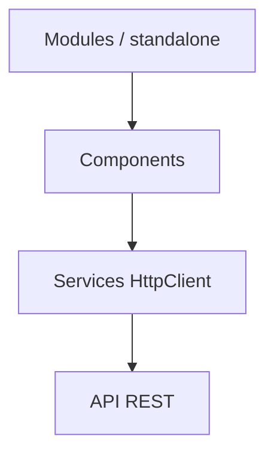

# Architecture — CRUD Angular

## Objectif

Application **Angular** (SPA) de type **CRUD** : liste, création, édition, suppression d’entités sur une API backend (selon configuration des services du projet).

## Structure Angular typique

| Zone | Rôle |
|------|------|
| `src/app/` | Composants, routes, services |
| `src/environments/` | URLs d’API dev / prod |
| `src/assets/` | Ressources statiques |

## Principes

- **Services** pour la logique d’accès HTTP et la réutilisation.
- **Composants** focalisés sur l’affichage et les interactions utilisateur.
- **Bootstrap** (et icônes) pour l’UI.

## Build

- `ng build` (production) ou `ng serve` (développement).
